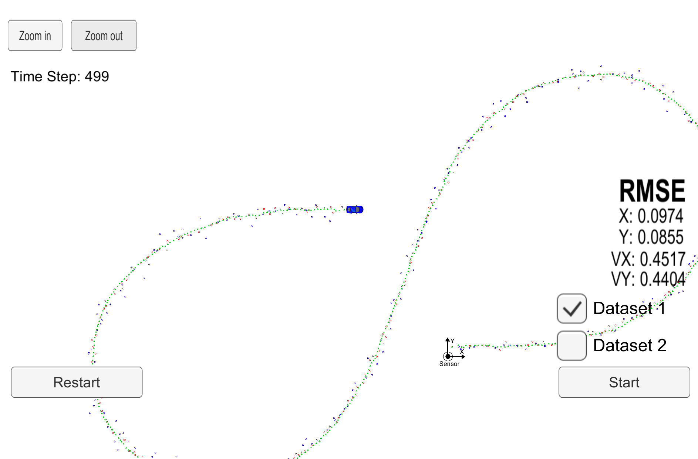
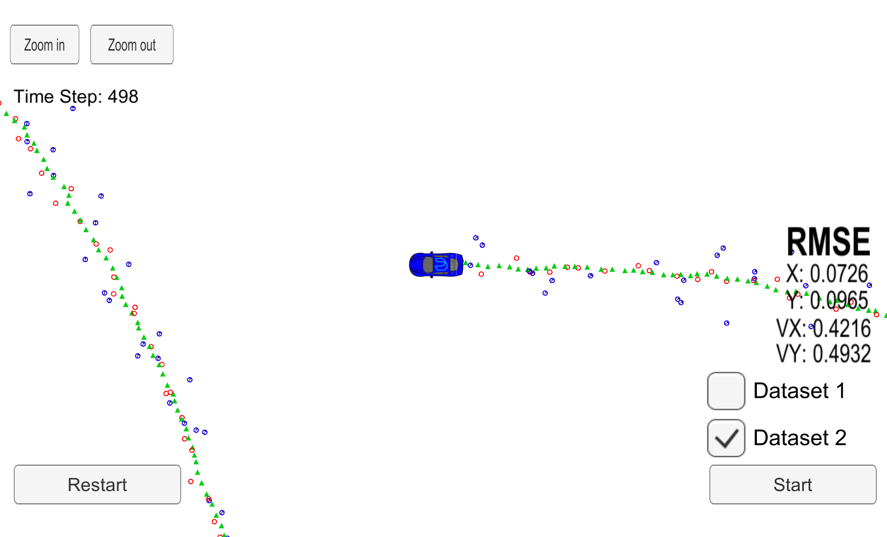

# Extended Kalman Filter Project Starter Code
Self-Driving Car Engineer Nanodegree Program

[//]: # "Image References"

[image1]: ./images/kalman_filter.png
[image2]: ./images/extended_kalman_filter.png

## Overview

In this project I utilized a kalman filter (lidar) and an extend kalman filter (radar) to estimate the state of a moving object with noisy lidar and radar measurements. RMSE values are computed for testing. Detailed explanation of the project is provided below.

Here is the main protocol that main.cpp uses for uWebSocketIO in communicating with the simulator.

**INPUT**: values provided by the simulator to the c++ program
["sensor_measurement"] => the measurement that the simulator observed (either lidar or radar)

**OUTPUT**: values provided by the c++ program to the simulator
["estimate_x"] <= kalman filter estimated position x
["estimate_y"] <= kalman filter estimated position y
["rmse_x"], ["rmse_y"]
["rmse_vx"], ["rmse_vy"]

Here is the RMSE result of this Kalman Filter:
<center class='half'>
    
    
</center>


## Build instructions

This project involves the Udacity Term 2 Simulator which can be downloaded [here](https://github.com/udacity/self-driving-car-sim/releases).

This repository includes two files that can be used to set up and install [uWebSocketIO](https://github.com/uWebSockets/uWebSockets) for either Linux or Mac systems. For windows use either Docker, VMware, or even [Windows 10 Bash on Ubuntu](https://www.howtogeek.com/249966/how-to-install-and-use-the-linux-bash-shell-on-windows-10/) to install uWebSocketIO.

Once the install for uWebSocketIO is complete, the main program can be built and run by doing the following from the project top directory.
1. mkdir build
2. cd build
3. cmake ..
4. make
5. ./ExtendedKF

#### Dependencies

* cmake >= 3.5
  * All OSes: [click here for installation instructions](https://cmake.org/install/)
* make >= 4.1 (Linux, Mac), 3.81 (Windows)
  * Linux: make is installed by default on most Linux distros
  * Mac: [install Xcode command line tools to get make](https://developer.apple.com/xcode/features/)
  * Windows: [Click here for installation instructions](http://gnuwin32.sourceforge.net/packages/make.htm)
* gcc/g++ >= 5.4
  * Linux: gcc / g++ is installed by default on most Linux distros
  * Mac: same deal as make - [install Xcode command line tools](https://developer.apple.com/xcode/features/)
  * Windows: recommend using [MinGW](http://www.mingw.org/)

## Method

In this project, both noisy lidar and radar data are provided. 

#### Kalman Filter

Kalman filter is used to process `lidar` data (which is in cartesian coordinate). Here is the formula:
![alt text][image1]

Because the data is in 2-D, F matrix is 4x4. The prediction step assumes the object is moving at **constant speed**. Acceleration and other movement uncertainty are included in the Q term. The overall derivation is based on **straight line motion**, hence it will underestimate the path if the object is in circular motion (a less curved trajectory will be predicted). R term is used to model the measurement noise. It is based on the assumption that the measurement noise in x direction and y direction is independent (i.e. the covariance is zero).

#### Extended Kalman Filter

Extended kalman filter is used to process `radar` data which is in polar coordinates. Here is the formula.

![alt text][image2]

The prediction step is kept the same as the position of the object is always measured in cartesian coordinate. It is then converted into polar coordinates as `h(x')` using the formula above. Afterwards, it is compared with the radar measurement data `z` and error is computed. Jacobian term `Hj` is computed to calculate kalman filter gain, to replace  the above `H` term in *kalman filter*.

## Code Explanation
Here are the main components in the code. Every time a data input is received by the code, FusionEKF::ProcessMeasurement(&data_input) (/src/main.cpp) is called for prediction and measurement update.

#### Kalman Filter object (/src/kalman_filter.cpp)
```cpp
class KalmanFilter {
    public:

    KalmanFilter();
    virtual ~KalmanFilter();
    void Init(&x_in, &P_in, &F_in, &Q_in, &H_in, &R_in);            
    void Predict();
    void Update(&lidar_data);          //kalman filter update
    void UpdateEKF(&radar_data);       //extended kalman filter update

    x_; P_; F_; //state vector, covariance matrix, state transition matrix
    Q_; H_; R_; // process covariance matrix, measurement matrix, measurement covariance matrix
};
```


#### Sensor Fusion object (/src/FusionEKF.cpp)
```cpp
class FusionEKF {
    private:

    bool is_initialized_;
    R_lidar; H_lidar;           //lidar measurement covariance matrix and transition matrix
    R_radar; Hj_;               //radar measurement covariance matrix and transition matrix

    public:

    KalmanFilter ekf_;          //use the kalman filter object created above
    FusionEKF();
    /*
        automatically initialise the efk_ object
        set above R_lidar, H_lidar, R_radar, Hj values;
    */
    virtual  ~FusionEKF();
    
    void ProcessMeasurement(&data_input);
    /*
        if initialised:
            //radar data only gives position in cartesian coordinate
            if data_input.type == 'lidar':
                px, py = data_input[0, 1]
                ekf_.x_ << px, py, 0, 0         //initial position

            //lidar data gives both position and velocity in polar coordinate
            else if data_input.type == 'radar':
                rho, phi, rho_dot = data_input[0, 1, 2]
                px = rho * cos(phi); vx = rho_dot * cos(phi)
                py = rho * sin(phi); vy = rho_dot * sin(phi)
                ekf_.x_ << px, py, vx, vy       //initial position and vel

        after it is initialised:

            //Prediction Step------------------------------------------------
            ekf_.F_ <- F matrix
            ekf_.Q_ <- Q matrix
            ekf_.Predict()

            //Measurement Update step----------------------------------------
            if      (data_input.type == 'lidar'):
                ekf_.R_ = R_lidar               // R_lidar initialised above
                ekf_.H_ = H_lidar
                ekf_.Updte(&data_input)

            else if (data_input.type == 'radar'):  
                ekf_.R_ = R_radar_              // R_radar initialised above
                ekf_.H_ = Hj_                   // Hj is computed (/src/tools.cpp)
                ekf_.updateEKF(&data_input)


    */
};
```


